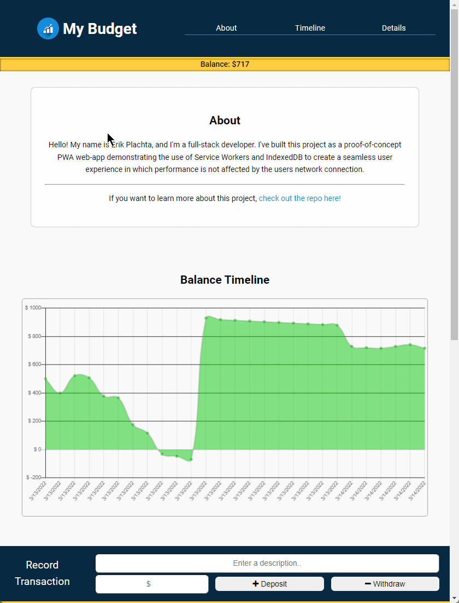

# My Budget - PWA - Concept Application

I've built this app to demonstrate how using a PWA and Service Workers can be used
in-hand with a Node/Express.js server to build a seamless user experience where
performance is not affected by the users network connection.

---

## Framework

> A list of non-dev dependencies and overall program architecture.

- **Heroku** is hosting the website.
- **MongoDB Atalas** is hosting the database.
- **Node.js** is running an **Express.js** server on **Heroku**.
- **WebManifest** is being used to define the PWA parameters.
- **Server Worker** is managing communication between **IndexedDB**, **Cached Storage** and the **Heroku** server.
- **IndexedDB** is storing offline data to enable offline functionality.
- **Cached Storage** is storing source-code to enable offline functionality.
- **Mongoose.js** is managing commuication between **MongoDB**, the Client, and **Heroku**.
- **Compression.js** is used to compress all content it can running through the app.

## [Deployed on Heroku](https://erikplachta-budget-pwa.herokuapp.com/#transaction-details)

Check it out live, here 👆🏼

## Demo

Here is a quick demo of it in action

---

## Contributor

[Erik Plachta](https://www.github.com/erikplachta)
> Redesigned everything, and built out a fully functional App

[Xandromus](https://www.github.com/Xandromus)
> Built rudimentary starter-content of the code as a starting point for the concept.
